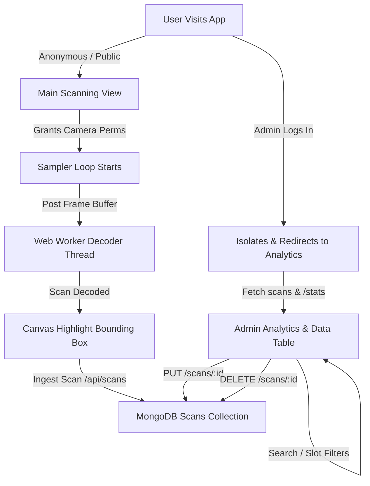

# ⚡ Advanced QR Scanner & Admin Analytics Dashboard

A premium, full-featured web application designed for real-time QR code scanning, tracking, and data analysis. Built on modern web standards, it integrates high-performance video frame sampling, multithreaded decoding, anonymous scan fallbacks, and a secure admin management interface.

---

## 🔗 Companion QR Generator
This scanning dashboard is designed to scan and register QR codes generated by its companion generator application:
* **QR Generator Web App**: [https://qr-app-rust.vercel.app/](https://qr-app-rust.vercel.app/)

Use the generator app to print or display custom QR codes, and use this scanner to parse them and view historical analytics.

---

## 🚀 Key Features

* **Real-time Camera Decoding**: Continuously samples and processes camera frames.
* **Smart Highlight Vector Outlines**: Automatically renders vector overlay contours around detected QR codes.
* **Neon Scanning Animation**: Features a moving neon scan-line animation overlaying the active video stream.
* **Manual Camera Ignition**: Auto-start disabled on initial load to respect user preferences (click "Start" to run).
* **Static File Scanning**: Drop-and-upload zone to parse QR codes from static image files (PNG, JPG, WebP).
* **Smart URL Redirection**: Automatically detects secure web links and renders instant redirect action buttons.
* **Capsule Auth Modals**: Elegant floating-pill tab switchers, rounded input fields, spacious layouts, and pill submit buttons.
* **Admin-Only Analytics Panels**: Restricted view showing aggregate scan counts, daily slot stats, and unique QR count.
* **Interactive Data Tables**: Full scan manipulation table for administrators to search, filter by time slots, edit, or delete entries.
* **Anonymous Ingestion**: Supports public scanner entries recorded without user credentials under an `"anonymous"` owner.

---

## 🛠️ Technology Stack

* **Frontend**: HTML5, Vanilla ES6+ Javascript, CSS3 (Custom HSL Dark Hues & Backdrop glassmorphism), Vite 5.
* **Scanning Engine**: Custom TypeScript Barcode Engine running in a dedicated multithreaded **Web Worker** context.
* **Backend**: Node.js, Express.
* **Database**: MongoDB.

---

## 📋 System Architecture & Workflow



### 1. Sampling & Threading Loop
The UI main thread samples video frames at 25 frames/sec, extracts `ImageData` buffers, and offloads them to a background `Worker` thread. This keeps the rendering process frame-rate fluid and prevents blocking.

### 2. Symmetrical Layout
On mobile viewports, the header adjusts into a clean grid displaying the hamburger menu on the far left, a centered logo title, and an icon-only login/logout button on the far right.

### 3. Role-Based Navigation
- **Regular Users**: Can scan QR codes anonymously or register an account to record personal scans in the "My Scans" historical view.
- **Admin Users**: Access restricted to the analytics management grid and the scans data table. All other public sections (Webcam Scanner, About, Features, Contact) are hidden upon admin login.

---

## ⚙️ Setup & Execution

### Prerequisites
* **Node.js** (v18+)
* **MongoDB** instance running locally.

### Environment Configuration
Create a `.env` file inside the `server/` directory:
```env
PORT=3000
MONGODB_URI=mongodb://localhost:27017/qr-scanner-db
JWT_SECRET=your_super_secret_jwt_key
```

### Installation & Run

1. **Install Root Dependencies**:
   ```bash
   npm install
   ```

2. **Install Server Dependencies**:
   ```bash
   cd server
   npm install
   cd ..
   ```

3. **Start the Express API Server**:
   ```bash
   npm start
   ```

4. **Start the Frontend Development Server**:
   ```bash
   npm run dev
   ```
   Open your browser to `http://localhost:5176`.

---

## 📄 License
MIT License - Copyright (c) 2026 Aishwary Jhaveri.
